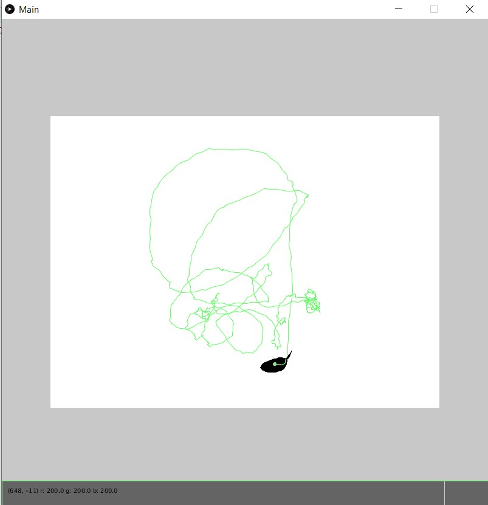
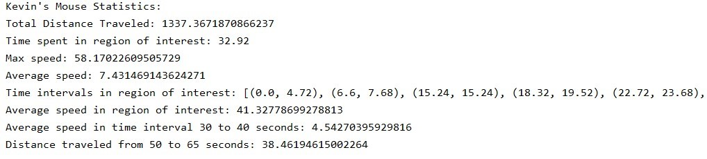

# DataSet_API_for_Animal_Tracking
DataSet API that creates statistics about an animal in an enclosure. A video filter analyzes the video to generate data.

MouseTracker(Animal Tracking filter)
- Filters video by using
  - matrix convolution box blur filter and threshold filter on a black & white video of an animal in an enclosure with a light background and bird’s eye view video
- Outputs recorded animal's positions into a csv file

DataSet can generate many statistics for the animal:
- average speed in time interval, region of interest
- total distance traveled in time interval, region of interest
- time intervals spent in the region of interest, at a certain speed
- total time spent in the region of interest, at a certain speed

Main2
-reads csv file containing data on animal's positions and creates a DataSet onject to get animal's statistics

Framework for webcam and video implementation written by David Dobervich is NOT included.
